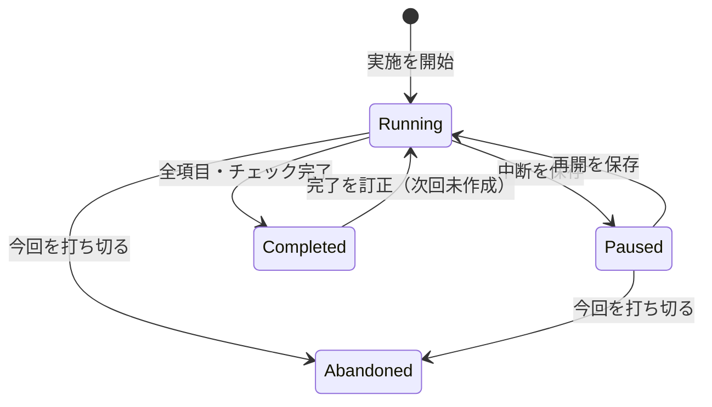

# 作業手順と実施記録の設計

作成日: 2026-09-10

状態: 初版実装済み（2026-09-10）。通常のToDo管理に加え、同じ手順の反復実施と中断・再開を扱う。
本文は当初の設計判断を残す。実装時の具体化・差分・検証結果は末尾の「実装結果」を参照。

## 1. 目的と設計判断

一連の作業を手順として残し、各ステップを実施し、全体の完了を記録する。
次回は未実施から始められ、前回の実施日時や中断時の状態も確認できる。

中心となる判断は「手順の定義」と「1回ごとの実施記録」を分けること。
リセットは前回の実績を消す操作ではなく、「次の実施を作成する」とする。
中断した作業は同じ実施記録を再開する。履歴の閲覧で現在の作業を巻き戻さない。

初版は独立した「手順プロジェクト」を既存のタブで開く方式を採用する。
通常のToDoから選択範囲を手順としてコピーできる。通常プロジェクト内へ実施記録を
混在させないため、過去の記録が現在の依存関係・進捗・次の一手に混ざらない。
1手順プロジェクトにつき1手順、進行中または中断中の実施は合わせて1件とする。

## 2. 既存機能との関係

| 現在の機能・実装 | 現状 | 今回の扱い |
|---|---|---|
| TodoProject / TodoNode | グラフ、状態、完了日時、メモなどを保存 | グラフの型と描画・分析を再利用する |
| BranchTemplate.Capture / Instantiate | 選択を独立した部品にし、新ID・未着手で配置する | 手順へのコピーと実績初期化の参考にする |
| WorkBookmark | プロジェクトに1つの対象ノードと再開メモ | 実施ごとの再開位置とメモに利用する |
| RepeatProgress / RepeatService | 1項目を指定回数達成すると完了 | 1回の実施の内部で引き続き利用する |
| ChecklistItem | カード内のチェック状態 | 実施ごとに未チェックから始める |
| プロジェクト変数 | タイトル・メモの原文を表示時に置換 | 実施開始時の変数値を記録に固定する |
| JSON保存・自動保存 | 形式10、5秒周期、1世代のバックアップ | 履歴も本体に保存。明示的な中断等では即時保存する |
| Undo/Redo | メモリ内の編集履歴 | 永続的な実施履歴とは分ける |

既存の「繰り返し」は回数の達成、今回の「もう一度実施」は作業一式の次回分作成。
作業のしおりは再開場所を示す機能であり、過去のチェック状態を保存する機能ではない。
現在の保存仕様は [STORAGE.md](STORAGE.md)、回数の仕様は [REPEAT_DESIGN.md](REPEAT_DESIGN.md) を参照。

## 3. 利用の流れと画面

### 手順を作る

通常ToDoの複数選択またはブロックのメニューに「作業手順として保存…」を追加する。
対象・手順名・保存先を確認し、独立した手順プロジェクトを新しいタブで開く。
元のToDoは変更しない。ブロック指定では子孫のステップも含む。
選択外への接続はコピーせず、除外される接続の件数と端点名を保存前に表示する。
最低1項目が必要。実施に不要な出発点やゴールを含めた場合も完了対象となることを表示する。

手順画面は「手順」「今回の実施」「履歴」の3つの表示を持つ。
手順は既存のグラフ編集操作で編集でき、ステップごとのタイトル・説明・チェック項目・
依存関係・回数目標を定義する。「手順を保存」で定義の改訂番号を増やす。
初版では保存済みの最新版から実施を始め、未確定の編集がある場合は開始前に保存する。

### 今回の実施を始める

「実施を開始」で任意の実施名（例: 9月第2週）、変数値、今回の期限を指定する。
開始ボタンで今回のグラフと開始日時を作り、全項目を未着手にする。
初版では予約状態を作らず、開始操作と同時に実施中となる。
未完了の実施がある場合は「続きから再開」へ誘導し、重複した実施を作らない。

今回の画面上部に実施名・状態・開始日時・進捗・保存状態を表示する。
グラフで選択したステップの手順説明と実施メモを右側に表示する。
実施中は構造・タイトル・手順説明・回数目標を固定する。
チェック、状態、達成回数、手動ブロックと理由、今回の期限、実施メモは編集できる。
手順に誤りを見つけた場合は定義を修正して次回へ反映するか、今回を打ち切って始め直す。

例（画面の情報構成。具体的な寸法やスタイルは実装時に既存UIへ合わせる）:

```text
毎週のバックアップ   ［手順］［今回の実施］［履歴］
9月第2週 / 実施中 / 2 of 3 完了 / 保存済み
［中断する］［今回を打ち切る］

［✓ 作成］→［✓ 転送］→［未着手 復元確認］

選択中: 復元確認
手順説明: テスト環境で復元し、ファイルを開く
今回のメモ: テスト環境が空いたら実施する
```

### 中断・再開する

「中断する」で再開するステップと中断メモを指定する。
選択中の未完了項目、なければ未完了項目を候補にする。メモは任意とし中断を妨げない。
チェック状態・達成回数・実施メモ・ブロック理由・変数・再開場所のスナップショットと
中断日時を保存する。保存成功後に「中断済み」と表示する。

「再開する」は同じ実施記録を実施中へ戻し、しおりの項目を表示・選択する。
再開によって達成済みの項目や回数は変えない。過去の中断記録も残す。
履歴から各中断時点を読み取り専用で閲覧できる。
画面のズームやスクロール位置の完全再現は初版の要件にしない。

アプリを閉じること自体は中断操作と同一視しない。次回は保存された状態から再開できるが、
明示的な中断記録は作らない。異常終了後に中断日時や理由を推測して追加しない。

### 完了・次回の実施

全項目がDone、かつ全チェックリストがチェック済みなら、自動で今回を完了にする。
最後の操作と全体の完了日時を同じ変更単位にまとめる。空の手順は作成・開始不可。
依存線は順序の案内とし、既存と同様に先行未完了でも実施の記録自体は許可する。
回数項目は目標到達が必要。取り消しは成功として数えず、全体の自動完了を妨げる。
既存のIsSettledは取り消しも含むため、今回の完了判定には使用しない。

完了後は読み取り専用にし、「もう一度実施」を表示する。
最新版の手順から新しい実施を作り、以前のチェック・メモ・日時は上書きしない。
途中で最初からやり直したい場合は「今回を打ち切る」で理由（任意）と終了日時を残し、
その後で次回分を作る。ボタン名に「リセット」は用いない。

誤った完了は「完了を訂正して再開」で明示的に実施中へ戻し、指定した1項目を未着手へ戻す。
回数項目なら達成回数も0にする。直前の完了スナップショットと訂正イベントを残す。
後続の新しい実施が既に存在する場合、初版では過去分の訂正再開を許可しない。
訂正後は未完了が残るので即座に自動完了へ戻らない。

## 4. 状態遷移



Completed / Abandonedから「もう一度実施」は、元の状態を変えず別IDのRunningを作る。
Pausedでは作業内容を変更できず、まず再開する。Abandonedは初版では読み取り専用。
読み込みだけでは状態遷移や日時の更新を行わない。

## 5. データモデル案

保存単位は手順定義と全実施記録を含む1つのファイルとする。
グラフを入れ子のTodoProjectで保持すると実施履歴まで再帰的に複製されるため、
履歴や文書種別を持たないGraphSnapshotを定義する。

| 型（新設案） | 主な内容 |
|---|---|
| ProcedureData | 手順ID、改訂番号、定義GraphSnapshot、実施記録一覧 |
| GraphSnapshot | Nodes、Edges、Blocks、Variablesの深いコピー |
| ProcedureRun | 実施ID、実施名、開始元改訂番号、状態、開始・更新・完了・打切日時、開始時定義、現在のグラフ、実施メモ、しおり、イベント、中断記録 |
| StepExecutionNote | 実施内のNodeId、今回のメモ |
| RunEvent | イベントID、連番、種別、発生日時、対象ID、変更前後の値 |
| RunCheckpoint | チェックポイントID、イベント連番、中断または訂正前完了の日時・状態、グラフ・実施メモ・しおりの深いコピー |

TodoProjectにDocumentKind（通常／手順、既定は通常）とProcedureData?を追加する案とする。
通常文書は既存のNodes等を使い、手順文書はProcedureDataを使う。
手順文書ではトップレベルのNodes・Edges・Blocks・Variables・Inboxを空、Bookmarkをnullにし、
二重の保存元を作らない。ビューに渡すTodoProjectは選択中のグラフから作る一時的なアダプターとする。
変更は専用サービス経由でProcedureDataへ反映する。通常保存へアダプターを渡さない。

手順内の項目IDは改訂間で可能な限り維持し、実施内では開始時のIDを維持する。
参照は実施ID＋項目IDで識別する。通常プロジェクトへのコピーでは既存同様にIDを再採番する。
実施内のグラフは互いに独立し、同じ項目IDでも他の実施への接続は禁止する。
開始時定義を各実施へ保存するため、過去の全改訂一覧を別途保存しなくても当時の手順を確認できる。

### 初期化・引継ぎ

| 内容 | 新しい実施の初期値 |
|---|---|
| タイトル、手順説明、依存関係、チェック項目、目標回数、見積り、タグ | 開始時の定義をコピー |
| 状態・回数・チェック | 未着手・0回・未チェック |
| 完了日時・しおり・実施メモ・手動ブロック・理由 | なし |
| 期限 | 初期値なし。開始画面で今回分を入力 |
| 変数 | 開始画面で確定した値をコピー。以後の定義編集に追従しない |
| 座標・色・ブロック・線の通過点 | 定義の配置をコピー |

手順説明はTodoNode.Notesを使用し、実施メモは別に保存する。
中断メモ・実施メモは初版では変数展開しないプレーンテキストとする。
日時はDateTimeOffsetで保存し、表示時にローカル時刻へ変換する。
時計の補正で時刻が前後しても履歴順を失わないよう、イベントの並びは連番で決める。
実施中の状態・回数・チェック・メモ・ブロック理由・期限の変更をイベント対象にし、
メモの入力は編集確定単位で記録する。毎キー入力の全文履歴は作らない。

## 6. 保存・復元・Undo

現在の形式10に対し、実装時の次の形式番号を割り当てる（現時点なら11）。
通常文書と手順文書の判別を必須の整合性検証に含め、旧文書は通常文書として移行する。
旧形式を名乗るファイルの手順データ、新形式の不正な組合せは拒否する。
現在のJSON_FORMAT.mdとSTORAGE.mdは未実装機能の仕様へ書き換えない。

開始・中断・再開・完了・打切・完了訂正では変更後の候補を作り、ファイルの置換が成功してから
その状態を採用する。失敗時は変更前の実施状態を維持し、理由と再試行を表示する。
最後のチェックによる完了保存が失敗した場合も、その最後の操作を未確定として再試行可能にする。
既存の自動保存と書き込みを直列化し、古いスナップショットで新しい状態を上書きしない。
通常の途中操作は既存周期で自動保存し、未保存・保存済み・保存失敗を表示する。
直近の周期以後の途中操作は異常終了で失われうる。明示的な中断は保存成功を確認できる。

実施イベントと現在の状態は同一ファイルの同一保存で更新する。
RunCheckpointは差分リプレイを必要としない独立スナップショットとし、読み取り専用で開く。
復元対象はアプリに記録した状態とメモであり、外部ファイルや実際の作業環境の復元は含まない。

実施中の通常操作はUndo/Redo対応とし、取消・再適用を新しい訂正イベントとして残す。
手順編集／実施／履歴でUndoの対象を分け、表示切替で別の対象を誤って巻き戻さない。
保存を伴う開始・中断・再開・完了・打切はUndo境界とし、専用操作で状態を変更する。
実施履歴やチェックポイントの自動削除はしない。肥大化対策は後続で保管用エクスポートを検討する。

読み込み・保存では、ID重複、不在参照、循環、ブロック・ポート、回数などの既存検証に加え、
実施中／中断中が最大1件、状態と日時の整合性、実施メモ・しおりの参照先、イベント連番、
チェックポイントの参照、Completedの全件完了条件を検証する。履歴内のグラフも検証対象。
不正な履歴を黙って削除して保存しない。

## 7. 実装の責務と順序

| 段階 | 主な変更候補 | 内容 |
|---|---|---|
| 1. Coreモデル | Models配下にProcedureData等 | 深いコピー、参照・状態の不変条件、初期化 |
| 2. Core操作 | 新設ProcedureService / ProcedureValidation | 開始・中断・再開・完了判定・打切・訂正。時刻は引数で渡す |
| 3. 永続化 | TodoProject、JsonProjectStore | 文書種別、移行、履歴検証、保存往復 |
| 4. 作業画面 | 新設MainViewModel.Procedures、WorkspaceViewModel | グラフ切替、保存の直列化、既存編集コマンドの許可制御 |
| 5. 手順作成 | MainViewModel.Templates、BranchTemplate周辺 | 範囲抽出を共通化。部品の既存保存形式と操作は維持 |
| 6. 状態操作 | MainViewModel.Editing / Repeat / Completion、NodeViewModel | 実施の操作サービス経由に統一、全体の完了処理 |
| 7. 再開・履歴 | MainViewModel.Bookmark、新設履歴ビュー | 実施ごとのしおり、中断記録の閲覧、読み取り専用制御 |

既存BranchTemplate.InstantiateはID再採番や位置固定解除を行うため、実施開始へそのまま流用しない。
初期化ルールを整理して共有できる部分だけ抽出する。
通常ToDoの統計を変更せず、手順画面の集計には表示中の実施だけを渡す。
エクスポートは選択中の定義または実施を明示し、履歴全体を通常グラフへ平坦化しない。
新しい外部パッケージは必要としない。

## 8. 初版の受け入れ条件

1. 選択範囲から手順を保存しても、元の状態・メモ・依存関係が変わらない。
2. 前回が完了／打切でも、新しい実施は未着手・0回・未チェックで始まる。
3. 定義や変数を更新しても、実施中・過去の手順と表示内容が変わらない。
4. 通常項目、回数項目、チェックリストがすべて達成されたときだけ全体が完了する。
5. 取り消した項目を成功と数えず、先行条件の警告と作業全体の完了を混同しない。
6. 中断後にアプリを再起動しても、実績・メモ・しおり・中断日時が復元される。
7. 複数回中断してもそれぞれの時点を閲覧でき、閲覧で現在の実績は変わらない。
8. 保存失敗時に中断／完了成功を表示せず、再試行で実施やイベントを重複作成しない。
9. 完了訂正では旧完了記録を残し、次回がある過去分を再開できない。
10. Undo/Redoで回数・状態・日時・全体進捗が食い違わず、異なる実施を操作しない。
11. 形式1〜10の通常文書、部品の配置、通常のしおり・回数機能が従来どおり動く。
12. 履歴を含むJSON往復、深いコピー、無効データ拒否をCoreで検証する。
13. 明暗テーマ、キーボード、IME、保存失敗、中断後の再開をWPFで確認する。

## 9. 後続で検討すること

初版には曜日による自動作成・通知、並行実施、任意時点への巻き戻し、手順改訂間の差分比較、
過去実施を基にした再実施、期間集計、外部環境の復元、複数人での共同作業は含めない。

週次作業はまず手動の「もう一度実施」で対応する。
将来周期設定を加える場合も、前回の記録を消さず次回を作成する規則を維持する。

[文書一覧](README.md) / [全体設計](DESIGN.md) / [保存と復旧](STORAGE.md)

## 10. 実装結果（2026-09-10）

- 保存形式11。通常のToDoはDocumentKind.Todo、手順文書はDocumentKind.Procedureとして保存する。
- 手順プロジェクトは既存のタブで開き、「手順を編集」と「今回の実施・履歴」で切り替える。
  実施と履歴は同じ画面の選択欄で切り替える。編集には既存のグラフ画面を使用する。
- 定義のステップ・接続・配置・変数に変更があれば、手動保存または自動保存成功時に改訂番号を増やす。
  手順内の状態・達成回数・チェック・期限・ブロック理由は実績として引き継がず正規化する。
  定義の作成／更新日時は比較を安定させるためUnixEpochとし、開始時に実施の日時を付け直す。
- 実施の開始・進捗操作・中断・再開・完了・打切・訂正は、候補データを同期保存してから採用する。
  途中のチェックも即時保存する点は、当初案の5秒周期だけの保存から強化した。
- メモ・理由・期限・回数の入力は保存ボタン、5秒周期、ステップ切替、中断、手動保存で確定する。
  進捗ボタンでも未確定の入力を同じ操作に取り込む。保存失敗や不正な回数は入力を残して切替を止める。
  中断メモ／打切理由の入力は、それぞれの操作時に記録する。
- RunStateがグラフ・項目IDごとの実施メモ・しおりを保持する。開始時の定義には今回選んだ変数値も固定する。
  RunEventは操作前後の実施状態をJSON文字列で保持する。復元にはCurrentと独立したCheckpointを使い、
  イベント文字列の再生は必要としない。表示するイベントは選んだ保存時点までに限定する。
- 実施中の通常操作のUndo/Redoは最大100件のメモリ履歴。取消／再適用は永続イベントに追記する。
  中断・再開・完了・打切・訂正と、別の実施への切替はUndoの境界になる。
- 定義の受信箱と通常の作業しおりは対象外として入口を非表示・無効化する。
  実施ごとのしおりは中断操作で記録する。履歴の図は読み取り専用のプレビューを用いる。
- 表示中の実施グラフは既存のMarkdown/Mermaid書き出しを利用できる。
  実施メモ・中断履歴を含む完全な記録はプロジェクトJSONに保存する。
- Core 254件、WPFスモーク233項目を確認。明暗テーマ、実施画面・中断履歴・メイン画面の編集切替をPNGで確認。
  実マウスの操作感、IME、OSの複数DPIは未確認。曜日による自動開始は初版の対象外。

主な実装: [状態操作](../src/ToDoTree.Core/Graph/ProcedureService.cs)、
[整合性検証](../src/ToDoTree.Core/Graph/ProcedureValidation.cs)、
[実施画面のモデル](../src/ToDoTree.App/ViewModels/ProcedureViewModel.cs)、
[実施画面](../src/ToDoTree.App/Views/ProcedureView.xaml)。
