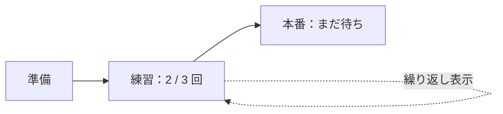

# 回数で完了する項目と自己ループ表示

作成日: 2026-09-08  
更新日: 2026-09-09

状態: 実装済み。2026-09-09に自己ループを外側の曲線表示へ更新（検証結果は末尾）

対象: 指定回数の達成で完了する単一の項目。ブロック所属の項目にも適用する。

## 1. 機能の意味

「練習を3回する」「レビューを2回する」を、項目を複製せずに管理する。
項目に目標回数と達成回数を持たせ、自己ループの矢印と `2 / 3 回` で表す。
**最後の1回を達成したときに項目が完了し、後続の依存条件が解消する。**

自己ループは繰り返し設定を表す。通常の依存線としては保存・計算しない。
`TodoGraph` の循環拒否を維持し、自動整列・先行判定・最長経路を現在の仕組みで扱えるようにする。



この図の自己ループだけが繰り返し表示。他の矢印は通常の依存関係。
初版は有限回数のみ。曜日・周期・期限の自動更新、無限反復、達成履歴の時系列記録、
複数項目をまたぐ周回は含めない。ノード種別（出発点・ステップ等）とは独立した属性にする。

## 2. 設定と操作

### 設定の入口

- 項目の右クリックに「繰り返しを設定…」を追加する。
- 自分の接続点から同じ項目へ線を戻すと、同じ設定画面を開く。
- 設定済みなら「繰り返しを編集…」。自己接続しても設定や矢印を増やさない。
- 詳細パネルからも設定・訂正できる。キーボード接続で自分自身を選んだ場合も同じ入口を使う。

ドラッグがしきい値を超えてから同じ項目へ戻った場合だけ設定画面を開く。
接続点の単純クリックや、接続開始直後の手ぶれでは開かない。
自分以外の項目への循環する線は、引き続きエラーとして扱う。

設定画面は「目標回数」「達成回数」と適用後の状態を表示する。
目標は整数 `2～9999`（初期値3）、達成回数は整数 `0～目標回数`。
入力中はモデルを変えず、「適用」でまとめて反映する。Esc・キャンセルは変更なし。

初めて設定する場合、未着手・進行中・取り消しは達成回数0を初期値とする。
完了済み項目は初期値を `3 / 3` とし、完了を維持することを画面で示す。
その後の入力変更では回数を勝手に丸めず、矛盾があれば適用を無効にする。

### 達成する

カードの操作は「1回達成」。1操作で1だけ増え、上限を超えない。
`2 / 3 → 3 / 3` で完了し、ボタンはチェック表示へ変わる。
完了済みのボタンを再度押しても回数を減らさない。
通常のクリック解放・Space・Enterに対応し、キー長押しによる自動リピートでは加算しない。

先行未完了でも達成の記録は可能とする。現在の手動状態変更と同じく、
依存関係を記録操作の禁止条件にはせず、「先行に未完了あり」の表示を維持する。

### 回数を訂正する

右クリック・詳細パネルに「1回戻す」「回数を訂正…」「繰り返しを解除」を置く。
達成ボタンの近くに常設のマイナスボタンは置かず、誤操作を減らす。
訂正画面では0へのリセットもできる。変更前後の回数と状態を示して適用する。

目標回数は達成回数より小さくできない。両方を訂正する場合は同じ適用操作で変更する。
例えば `3 / 3` の目標を5へ変更すると `3 / 5・進行中` になり、後続条件を再計算する。
解除は回数情報を削除し、現在の状態を通常項目へ引き継ぐ。解除前にその結果を表示する。

## 3. 状態のルール

`N` は目標、`c` は達成回数。通常の項目には現在の状態操作を維持する。
繰り返し項目の状態は、回数の操作と一体で変更する。

| 操作・条件 | 回数 | 状態・完了日時 |
|---|---|---|
| 設定、達成0回 | 0 / N | 未着手。設定前が進行中なら維持。完了日時なし |
| 「着手する」 | 0 / N | 進行中。回数は増やさない |
| 「1回達成」、最終回より前 | c + 1 < N | 進行中。完了日時なし |
| 「1回達成」、最終回 | N / N | 完了。完了日時を現在時刻へ |
| 完了済みへの「1回達成」 | N / N | 変更なし。履歴も追加しない |
| 「1回戻す」・回数訂正 | 0 < c < N | 進行中。完了日時を消す |
| 「1回戻す」・回数訂正で0へ | 0 / N | 未着手。完了日時を消す |
| 回数訂正で上限へ | N / N | 完了。新たに完了になった場合だけ日時を設定 |
| 「取り消す」 | 保持 | 取り消し。完了日時を消す |
| 取り消しから「再開する」 | 保持 | 0なら未着手、途中なら進行中、Nなら完了 |

取り消し中は「1回達成」「1回戻す」を無効にする。設定・回数の訂正は可能で、
取り消し状態を維持する。再開して完了になる場合の完了日時は再開時刻とする。
完了状態を維持する設定編集では、既存の完了日時を変えない。

現在は取り消しも `IsSettled` に含まれる。この機能でも取り消しは後続の待ちを解消するが、
達成回数を目標へ水増ししない。表示は `取り消し・1 / 3 回` のように区別する。

後続が未着手なら、完了から回数を戻したときに再び待ちになる。
既に進行中・完了の後続は自動リセットせず、既存の未完了先行の警告ルールを適用する。

## 4. 既存の完了操作への組み込み

`ToggleDone()` と `SetStatusOfSelection()`、`NodeViewModel.Status` の直接変更を調整する。
繰り返し項目だけ `Status = Done` にして回数を置き去りにする経路を残さない。

- 単一項目のSpace・右クリックの既存「完了」は、繰り返しなら「1回達成」になる。
- 通常項目だけの複数選択は、現在の「まとめて完了／未着手に戻す」を維持する。
- 繰り返しを含む複数選択では、通常の未完了項目を完了にし、繰り返しの未完了項目を各1回加算する。
  完了済みは変更せず、取り消し中の繰り返しは対象外。全件完了でも自動的に巻き戻さない。
- 混在選択時のメニューとツールチップは「通常項目を完了・繰り返しを1回達成」と明記する。
- 繰り返し項目の詳細パネルは汎用状態ドロップダウンを専用操作に切り替える。
  「着手する」「取り消す／再開する」と回数訂正を提供し、途中の回数のまま完了状態を選べないようにする。
- 目標までまとめて達成済みに直す場合は、回数訂正で達成回数を目標と同じ値にする。

1回の達成・訂正・設定・解除はそれぞれUndo 1回。複数選択も全体でUndo 1回。
連続した達成を時間ベースで1履歴にまとめない。Undo/Redoは回数・状態・完了日時を同時に復元する。

## 5. 画面の見せ方

### カード表示

カード上辺の右寄りから出て、上へ弧を描き、左寄りへ矢印で戻る自己ループ線を描く。
線上に `2 / 3 回` のバッジを置き、クリックで回数設定を開く。
カード右下は「＋1 回」、上限では「✓ 達成済み」。折りたたみボタンと操作領域を分ける。

線と矢印はベクターで描く。接続中は同じ形の破線を予告する。
`RepeatLoopVisuals` に曲線・矢印・表示範囲を集約し、カード自体の接続寸法と分ける。
上側56 DIPを表示範囲に含め、ブロックの見出し、全体表示、画面内へのスクロール、
ミニマップの範囲、自動整列の余白へ反映する。中を整列するときはループ込みで見出し位置を維持し、周囲との重なりも検証する。

ループは繰り返し設定の表示として保存値から生成し、依存線の循環判定は維持する。
編集は線上のバッジから行う。線のDelete・通過点追加・線の色変更は自己ループには適用しない。
手動でカードを近づけた場合の線やラベルの重なりは、自動的に座標を変えず、整列で解消する。

### ミニマル表示・ブロック折りたたみ

ミニマル表示も丸から出て丸へ戻る曲線と、線上の回数を表示する。
4桁の回数が収まる112 DIP幅を確保し、名前と回数を別々に読めるようにする。
加算は選択後のSpace・右クリック・詳細パネルから行う。
完了非表示の対象になるのは最終回の後。途中の達成ではカードを消さない。

畳んだブロックでは個々の回数とループ線を非表示にし、現在の項目単位の完了件数を維持する。
例えば1項目が2/3回でも、その項目はブロックの完了件数に加算しない。
ブロックへの接続は、所属する繰り返し項目の最終回まで待つ。

### フィードバック・アクセシビリティ

途中回ではバッジだけ短く反応し、「2 / 3 回達成しました」と表示する。
最終回だけ現在の完了演出と後続解放の案内を出す。
途中回のホバー案内は「次の1回：2 / 3 回」、最終回は「次の1回で完了：○件に着手できます」。

`CompletionImpact.Calculate` に渡すのは、今回実際に完了へ移る項目だけとする。
混在選択では最後の1回を迎える繰り返し項目と通常の完了対象をまとめて計算する。
回数訂正・目標変更・Undo/Redoでは通常の再描画と状態案内を行い、達成演出は再生しない。

色だけに頼らず、回数・チェック・状態名で伝える。明暗のテーマキーを使用する。
ボタンの読み上げ名は「練習を1回達成、現在2回、目標3回」の形式。
ホバー、押下、キーボードフォーカスを用意し、IME入力中のSpace/Enterを横取りしない。

## 6. データと整合性

追加する型の案:

```csharp
public sealed class RepeatProgress
{
    public int TargetCount { get; set; } = 3;
    public int CompletedCount { get; set; }
}

// TodoNode に追加。null は従来の通常項目。
public RepeatProgress? Repeat { get; set; }
```

`Repeat` はノード種別から独立する。`TodoEdge` に特別な辺種別を追加しない。
`TodoNode.Clone()` はRepeatも複製し、履歴・部品・プロジェクト複製で参照を共有しない。
各回の日時は初版では保存せず、`CompletedAt` は項目全体の最新の完了遷移日時に使う。

繰り返し項目の不変条件:

- 2 <= TargetCount <= 9999、0 <= CompletedCount <= TargetCount。
- 取り消しを除き、CompletedCount == TargetCount と Status == Done が一致する。
- 0 < CompletedCount < TargetCount の場合、状態は進行中または取り消し。
- 0回の場合、未着手・進行中・取り消しのいずれか。
- 完了以外の状態でCompletedAtを保持しない。完了への操作では必ず日時を設定する。
  新形式の繰り返し項目は、読み込み時にも完了日時と状態の整合性を検証する。

Coreに `RepeatService` を設け、検証と状態遷移を集約する。
加算・減算・設定変更・解除・取消・再開は、変更前後と完了遷移の有無を返す。
時刻を引数で受け取り、同じ操作のUpdatedAt/CompletedAtを揃えてテスト可能にする。
無効操作は変更前に拒否し、モデル・Undo・Redo・未保存状態を変えない。

## 7. 保存、再利用、集計

保存形式は現在の5から **6** へ上げる。例:

```json
{
  "status": "InProgress",
  "repeat": { "targetCount": 3, "completedCount": 2 }
}
```

これは新フィールドを示す抜粋。実際の名前・列挙値表記は既存JSON設定に従う。
形式1～5の読み込みではRepeat=nullとして移行する。
旧形式を名乗るデータに非nullのRepeatがある場合、解釈せず不整合として拒否する。
形式6の不正な回数・状態は黙って補正せず、対象項目を示して読み込み・保存を拒否する。
形式6の書き出しで旧アプリによる上書きを防ぐ。

| 経路 | 扱い |
|---|---|
| 通常保存・自動保存・復旧用保存 | 目標・達成回数・状態・日時を同じスナップショットで保存 |
| Undo/Redo・作業中プロジェクトの複製 | 目標と達成回数を保持し、深いコピーにする |
| 部品として保存 | 目標を保持し、実績は0・未着手・完了日時なしに正規化したコピーを保存。元の項目は変えない |
| 部品の配置 | 達成回数0・未着手・完了日時なしで新しいIDへ配置 |
| ステップの分割 | 初版は繰り返し項目を対象外とし「繰り返しを解除してから分割してください」と表示 |
| Markdown / Mermaid書き出し | 項目の表示名に「2 / 3 回」を添える。依存線には自己ループを出力しない |
| 全体進捗・ブロック完了数 | 既存の項目単位。3回中2回でも項目全体は未完了 |
| 見積もり・重み付き進捗・最長経路 | 見積もりは全回分の合計。目標回数による自動乗算や部分加算はしない |
| 期限 | 項目全体の完了期限。各回に期限を設けない |

部品ストアも形式6へ移行し、プロジェクトと同じ繰り返し検証を呼ぶ。
通常の項目の保存値と現在の集計式は維持する。

## 8. 実装の担当箇所と順序

| 段階 | 主な箇所 | 変更内容 |
|---|---|---|
| 1. Core | `TodoNode`、新設`RepeatProgress`・`RepeatService` | 不変条件、回数と状態の遷移、Clone |
| 2. 保存・再利用 | `TodoProject`、`JsonProjectStore`、`BranchTemplate`、`BranchTemplateStore`、`GraphExporter` | 形式6、共通検証、実績リセット、書き出し |
| 3. 状態操作 | `NodeViewModel`、`MainViewModel.Editing`、`SetStatusOfSelection`の定義箇所 | 完了操作の振り分け、混在選択、履歴の原子性 |
| 4. 設定UI | 詳細パネル、項目メニュー、設定画面 | 目標・回数の編集、訂正、解除 |
| 5. 自己接続 | `GraphView.xaml.cs`、`MainViewModel.Selection` | 同一項目への接続を検出し設定要求へ変換。Coreの循環判定は維持 |
| 6. 表示 | `GraphView.xaml`、`NodeViewModel`、テーマ、`NodeStyleMetrics` | ループ印、バッジ、加算ボタン、表示モード対応 |
| 7. 完了連携 | `GraphView.Completion`、`MainViewModel.Completion` | 最終回だけ完了予告・演出・後続解放 |

ドラッグのマウス解放処理には現在「接続先が自分と異なる」条件があるため、
`TryConnect`だけを変えても設定画面へ到達しない。マウス・キーボード両方で自己接続を扱う。
UI側は「依存線を作成」と「繰り返し設定を要求」を分け、キャンセルを接続成功として扱わない。

## 9. ブロック全体の周回について

初版の自己ループ設定は単一項目のみ。ブロックから自分自身への接続では、
「ブロック全体の繰り返しは未対応です。中の項目には設定できます」と案内し、変更しない。

将来ブロックへ広げる場合は「中の一連の作業をN周する」を別設計にする。
途中周の完了時に所属項目の状態をリセットすると、現在の全所属項目への依存展開では
外部の後続が一瞬着手可能になったり、完了済みの記録が失われたりする。
ブロック自身の周回状態・外部への完了条件・各周の実績を持たせる必要がある。
所属変更、内部項目の繰り返しとの組み合わせ、取り消しを1周に数えるかも合わせて決定する。

## 10. 受け入れ条件

1. 0/3→1/3→2/3では後続が待ち、3/3でのみ完了日時と後続解放が更新される。
2. 別の未完了先行がある後続は、最終回を達成しても着手可能にならない。
3. 上限での再操作・0回からの減算・無効設定ではデータと履歴が変わらない。
4. 3/3から2/3へ訂正すると完了日時が消え、未着手の後続が再び待ちになる。
   進行中・完了の後続は自動変更されない。
5. 取消は回数を保持し、再開・設定変更・解除・0への訂正も状態表どおりになる。
6. 目標変更と達成回数の変更は同時に検証・反映され、Undo/Redoで両方が戻る。
7. 単体・複数選択・混在選択の完了操作が同じルールを使い、最終回の対象だけを完了予告に渡す。
8. 自分へのドラッグとキーボード接続は設定を開く。単純クリック・キャンセルは変更せず、通常の循環は拒否する。
9. 保存再読込・自動保存・復旧・Cloneで回数が保たれ、形式6の不正値と旧形式を名乗るRepeat入りデータは拒否される。
10. 部品保存・配置は実績0で、元プロジェクトの実績を変更しない。書き出しに回数が含まれ、依存グラフに自己辺が混入しない。
11. 明暗テーマ、カード／ミニマル、長い名前、4桁の回数、ブロック内・折りたたみ・集中表示で操作が重ならない。
12. 実マウスのドラッグ、ボタン外での解放、Tab/Space/Enter、キー長押し、IME、複数DPIを確認する。

実装時はCoreの状態・保存・部品テストとWPFスモークテストを追加する。

## 11. 実装の記録

2026-09-08に段階1〜7を実装した。主な配置は次のとおり。

| 役割 | 実装 |
|---|---|
| 回数の入れ物 | [`RepeatProgress`](../src/ToDoTree.Core/Models/RepeatProgress.cs)、`TodoNode.Repeat` |
| 検証と状態遷移 | [`RepeatService`](../src/ToDoTree.Core/Graph/RepeatService.cs) |
| 保存形式6と検証 | [`JsonProjectStore`](../src/ToDoTree.Core/Storage/JsonProjectStore.cs)、[`BranchTemplate`](../src/ToDoTree.Core/Graph/BranchTemplate.cs) |
| 操作・履歴・案内 | [`MainViewModel.Repeat`](../src/ToDoTree.App/ViewModels/MainViewModel.Repeat.cs) |
| 設定画面 | [`RepeatSettingsWindow`](../src/ToDoTree.App/Views/RepeatSettingsWindow.xaml) |
| 自己接続と表示 | [`GraphView`](../src/ToDoTree.App/Controls/GraphView.xaml.cs)、`GraphView.Repeat`、`GraphView.Completion` |
| 検証 | [`RepeatTests`](../tests/ToDoTree.Core.Tests/RepeatTests.cs)、[WPFスモーク](../tests/ToDoTree.App.SmokeTests/Program.cs) |

### 設計から変えた点

- 「繰り返しを編集…」と「回数を訂正…」は同じ画面にした。入口が2つに増えると、
  同じ画面が別物に見える。右クリックは「繰り返しを編集…」、詳細パネルのリンクは「回数を訂正…」。
- 解除は、設定画面では結果を常時表示し、メニューからは確認ダイアログで結果を示してから実行する。
- 2026-09-09、利用者の要望に合わせてバッジ内のループ印を外側の自己ループ線へ変更した。
  ドラッグ・キーボード接続中も同じ形の破線で予告する。回数と依存関係の保存形式は変えない。
- カードの加算ボタンは「＋1 回」、上限では「✓ 達成済み」。読み上げ名は
  「（名前）を1回達成、現在2回、目標3回」の形式で、状態は色に頼らず文字でも伝える。
- `取り消し・1 / 3 回`の区別は、状態名の文字列を変えるのではなく、
  カードのバッジと一覧の回数表示で示す。

### 2026-09-09の検証

- ソリューションのビルド成功（警告・エラーなし）。
- Coreテスト198件、WPFスモーク87件が成功。
- 明暗テーマ、カード／ミニマル、長い名前、4桁の回数、ブロック内の曲線をPNGで確認。
- ミニマルのラベル右端のヒットテスト、自己接続プレビューと取消、縦横のブロック内整列、見出し位置の維持とUndoを検証。
- 無人検証で設定ダイアログを開かないよう、設定要求の検証中はビューを一時的に切り離す。
  検証用ブロックは作成条件を満たす2項目で構成する。
- 実マウスの操作感、IME、OSの複数DPIは未確認。

[文書一覧](README.md) / [全体設計](DESIGN.md) / [ブロック接続](BLOCK_CONNECTIONS.md)
